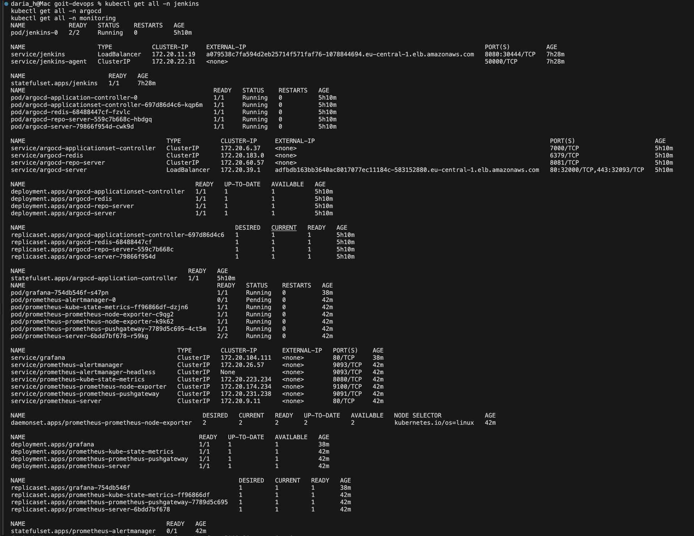
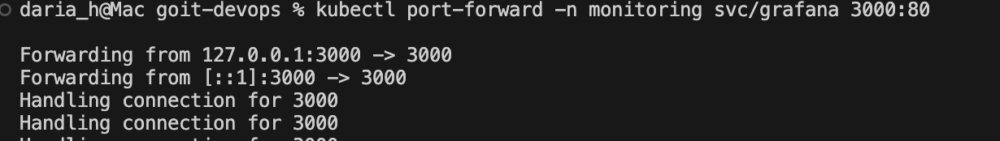
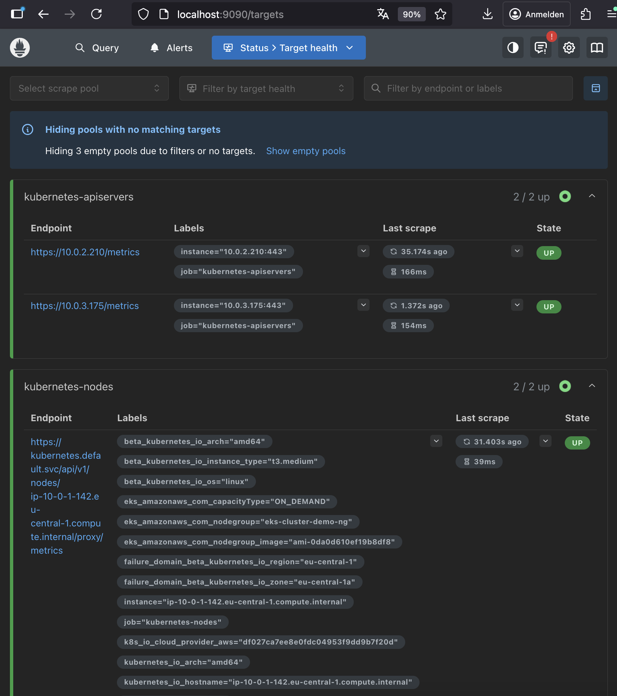
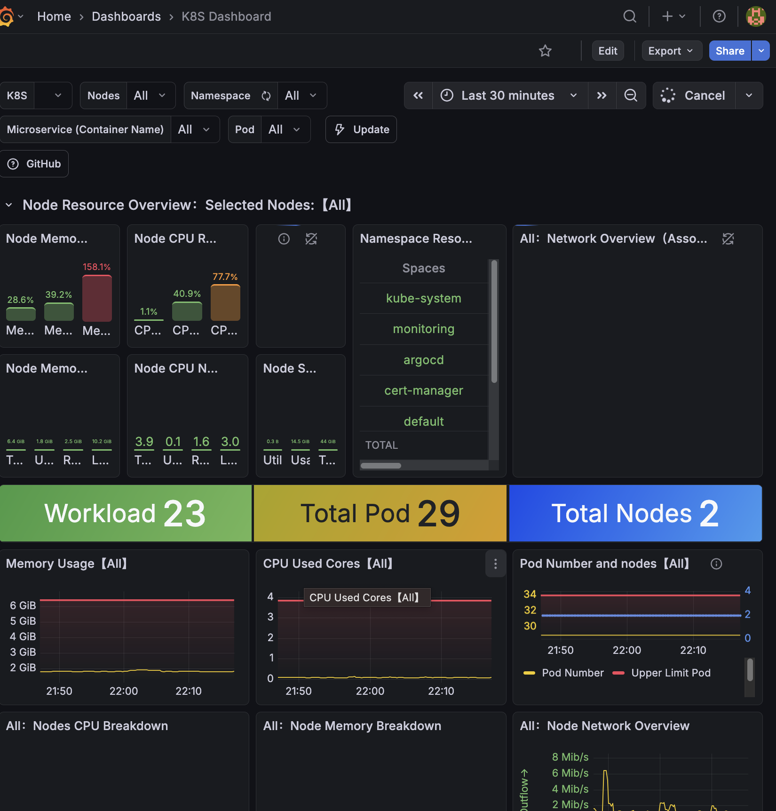
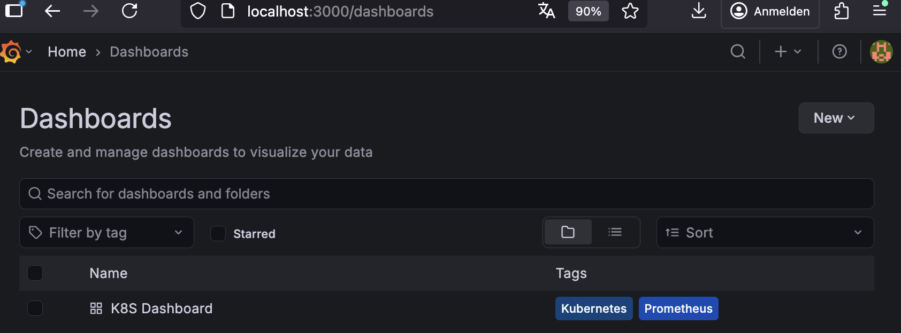

1. Resource Status

```
kubectl get all -n jenkins
kubectl get all -n argocd
kubectl get all -n monitoring
```



2. Service availability check

```
kubectl port-forward svc/argocd-server 8081:443 -n argocd
```


```
kubectl port-forward svc/grafana 3000:80 -n monitoring
```



```
kubectl port-forward svc/jenkins 8080:8080 -n jenkins
```


3. Prometheus is available locally



4. Grafana is available locally




